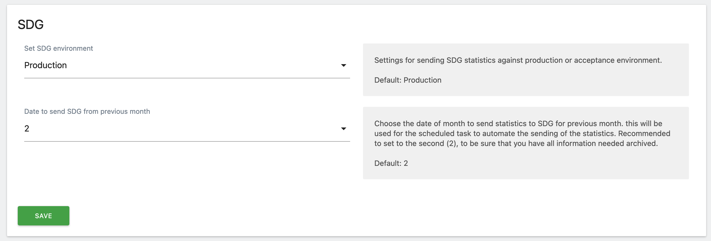
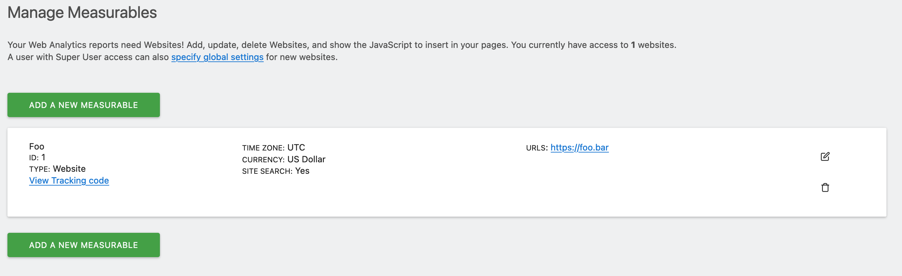
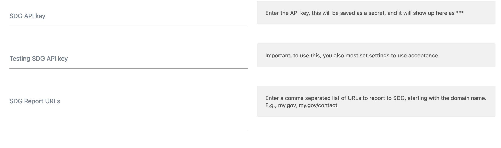
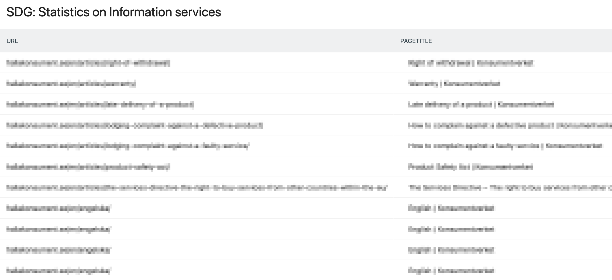

# Documentation

SDG - Matomo plugin to use for sending data to Single Digital Gateway.

## Installation

[Download and install the plugin as you normally do](https://matomo.org/faq/plugins/faq_21/).

## Settings

### Set SDG environment

Here you can set Testing (acceptance) or Production environment. Testing is if you would like to test the setup, or if you are running a test instance.

### Date to send SDG from the previous month

We recommend using the second of the month (default), as the plugin uses archived data, and the plugin try to send your data as soon as possible on the date you set, you should send at least the second, as all your data may be not be archived yet.

### Add API settings to a measurable (website etc.)

Every website uses separate settings for SDG, as you could have different API keys for sites, so we need to add them. Go to the website you want to add URL:s and API-keys for. Website -> Manage.

Add the needed information in the fields:

You must at least provide an API-token and one report URL.
Now you are all set to start sending data to the Single Digital Gateway.

## Report data

Information about what is going to be sent, or have been sent, to the gateway you can see in the SDG report (you can use the monthly view in the Matomo UI to see the report per month).

